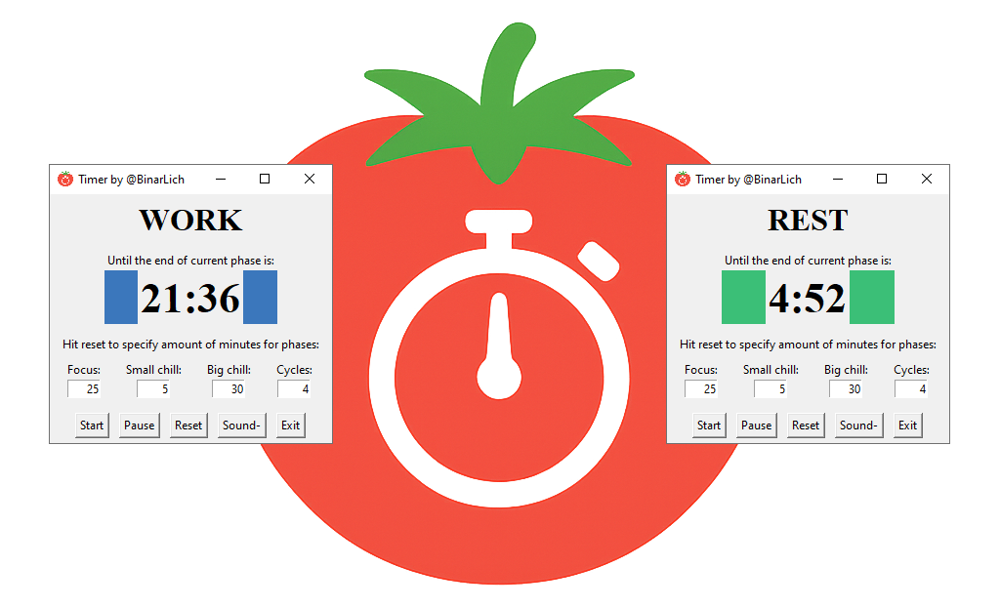

<p align="center">Simple Pomodoro timer written on Python with Tkinter.</p>

---
# Overview:

Simple Pomodoro timer. The timer structures work and break intervals using the Pomodoro method to boost focus and prevent burnout.

# Feautures:

- You may drop into root folder with script `.mp3` files, they will play on as signal. Name them: `Work.mp3` and `Rest.mp3`

- Or you may specify path to sound files. Simply paste them into path.txt as it says inside.

- You may disable sound not only via button, but to set default disable on start delete `path.txt` file.
# How to install and run

## Windows: 

1. Download repo.

2. Install python via official, as i tested on 3.11.9 link to this version:
```
https://www.python.org/downloads/release/python-3119/
```

3. Install Pygame 2.6.0 to your python 3.11.9 environment via pip:
```
python 3.11 -m pip install -U pygame==2.6.0
```
*If you already have Python/Pygame installed it may work on your version,
also pip comes with Python in new versions*

4. To supress console window on Windows rename to `.pyw`
5. Run Timer.pyw

## Linux/Mac:

1. Install Pygame:
```
python -m pip install -U pygame==2.6.0
```

2. Run Timer.py

# Troubleshoot:

If you have some problems start script with console, it wrutes whats wrong in it.

- On Windows your filename should be `.py`
- On Linux/Mac start script via terminal.

If you found some bugs feel free to write: [issues](https://github.com/BinarLich/pomodoro-timer/issues)
